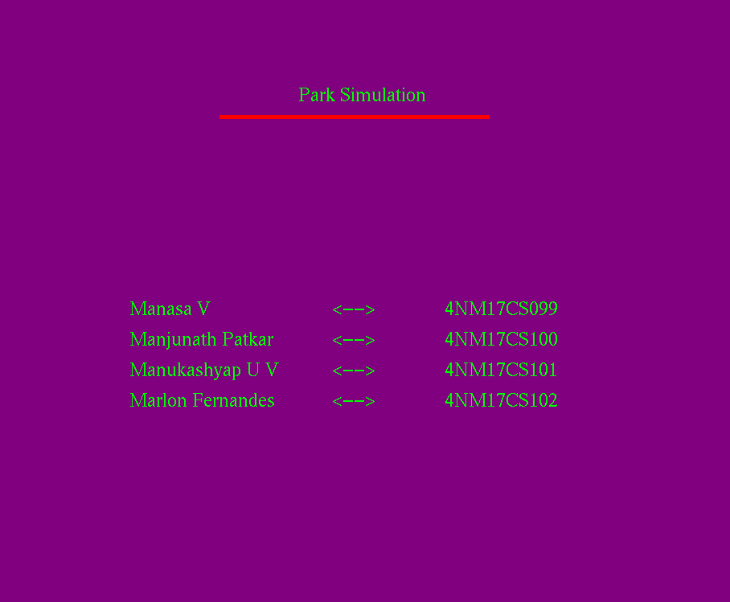

# CG PROJECT

This the the mini project for the class of Computer Graphics of VII semester of NMAMIT.
Project Repository : https://github.com/kashyapmanu/CG-PROJECT 

**Team Members**

|USN| Name  |
|--|--|
|4NM17CS099| Manasa V|
|4NM17CS100| Manjunath Patkar|
|4NM17CS101| Manukashyap U V|
|4NM17CS102| Marlon Fernandes|

**Tech used:**

- OpenGL

- CodeBlocks

- Ubuntu

Installing OpenGL on ubuntu and running it through code blocks:

    1 - Installing code blocks :
	    sudo apt install codeblocks
    2 - Installing openGL :
	    sudo apt-get update
	    sudo apt-get install freeglut3-dev
    3 - Change the linker setting in codeblocks : -lGL -lGLU -lglut

**Intro Page** 
Displaying the project name and the collaborators list.

Code:
	    
	#include<GL/glut.h>

    void init()
    {
	    glClearColor(0.5,0,0.5,0.5);

	    glMatrixMode(GL_PROJECTION);

	    glOrtho(0,50,0,50,0,10);

	}

	void Display_on_screen(char *string)

	{
	    while(*string)
	    {		     
		    glutBitmapCharacter(GLUT_BITMAP_TIMES_ROMAN_24,*string++);
	    }
	}

	void display()
	{

	    glClear(GL_COLOR_BUFFER_BIT);

	    glColor3f(0.0,1.0,0.0);

	    glRasterPos2i(15,40);

	    glRasterPos3f(19.5,40,0);

	    Display_on_screen("Park Simulation");

	    glRasterPos3f(12,26,0);

	    Display_on_screen("Manasa V");

	    glRasterPos3f(21,26,0);

	    Display_on_screen("<-->");

	    glRasterPos3f(26,26,0);

	    Display_on_screen("4NM17CS099");

	    glRasterPos3f(12,24,0);

	    Display_on_screen("Manjunath Patkar");

	    glRasterPos3f(21,24,0);

	    Display_on_screen("<-->");

	    glRasterPos3f(26,24,0);

	    Display_on_screen("4NM17CS100");

	    glRasterPos3f(12,22,0);

	    Display_on_screen("Manukashyap U V");

	    glRasterPos3f(21,22,0);

	    Display_on_screen("<-->");

	    glRasterPos3f(26,22,0);

	    Display_on_screen("4NM17CS101");

	    glRasterPos3f(12,20,0);

	    Display_on_screen("Marlon Fernandes");

	    glRasterPos3f(21,20,0);

	    Display_on_screen("<-->");

	    glRasterPos3f(26,20,0);

	    Display_on_screen("4NM17CS102");

	    glColor3f(1.0,0.0,0.0);

	    glLineWidth(5);

	    glBegin(GL_LINES);

	    glVertex2i(16,39);

	    glVertex2i(28,39);

	    glEnd();

	    glFlush();

	}

	int main(int argc, char **argv)
	{

	    glutInit(&argc,argv);

	    glutInitDisplayMode(GLUT_SINGLE|GLUT_RGB);

	    glutInitWindowPosition(1,1);

	    glutInitWindowSize(1400, 950);

	    glutCreateWindow("PROJECT");

	    init();

	    glutDisplayFunc(display);

	    glutMainLoop();

	}

Result:

